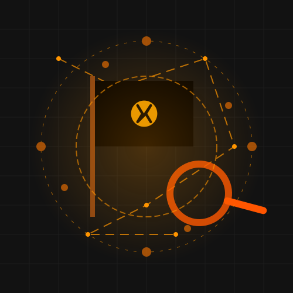

# NARRR - Narcissistic Relay-Related Search

A pirate-themed, cyberpunk search engine for the Nostr network built with Next.js and NDK (Nostr Development Kit). NARRR lets you search through the decentralized web of Nostr notes with style.

<p align="center">
  
</p>

## 🏴‍☠️ What is NARRR?

NARRR (Narcissistic Relay-Related Search) is a specialized search engine for the Nostr protocol. It allows you to search for content across the decentralized Nostr network, find notes, media, and connect with users in a pirate-themed cyberpunk interface.

**🔗 Live App**: [NARRR Search](https://narrr-search.vercel.app)

### What is Nostr?

[Nostr](https://nostr.com) (Notes and Other Stuff Transmitted by Relays) is a simple, open protocol that enables global, decentralized, and censorship-resistant social media. Unlike traditional platforms, Nostr:

- Is not a single website or app, but a protocol (like HTTP or SMTP)
- Allows users to control their data across multiple clients and relays
- Is resistant to censorship through its decentralized nature
- Uses cryptographic keys for identity, making accounts portable

## ✨ Key Features

- **NIP-07 Authentication**: Login with your Nostr browser extension (like nos2x, Alby, or Blockcore)
- **Advanced Search**: Search for notes, hashtags, and content across the Nostr network
- **Smart Result Prioritization**: Results from you and users you follow appear first
- **Real-time Results**: See search results as they stream in from connected relays
- **Inline Media Rendering**: Automatically displays images, videos, and YouTube embeds from links
- **Automatic URL Detection**: Makes all URLs in notes clickable, opening in new tabs
- **Verified User Indicators**: Shows verification status using NIP-05 identifiers
- **Custom Relay Support**: Uses your preferred relays when logged in
- **Responsive Design**: Works seamlessly on mobile and desktop devices
- **URL Deep-Linking**: Share search results via URL (e.g., `?q=bitcoin`)
- **One-Click Sharing**: Copy search URLs to clipboard with the Share button
- **Intelligent Content Display**: Media URLs are removed from text when rendered as media

## 🏗️ Technical Architecture

NARRR is built on a modern tech stack designed for performance and scalability:

### Frontend
- **Next.js 14**: React framework providing server-side rendering and optimized build process
- **React 18**: Component-based UI library for building interactive interfaces
- **Tailwind CSS**: Utility-first CSS framework for rapid UI development
- **Headless UI**: Unstyled, accessible UI components
- **Heroicons**: Hand-crafted SVG icons

### Nostr Integration
- **NDK (Nostr Development Kit)**: Core library for interacting with the Nostr protocol
- **NIP-07 Support**: Authentication via browser extensions
- **NIP-50 Implementation**: Search functionality across relays
- **NIP-05 Verification**: For user identity verification

### Backend Architecture
- **Client-Side Relay Communication**: Direct communication with Nostr relays
- **Dynamic Relay Discovery**: Uses user's preferred relays when logged in
- **Event Filtering and Caching**: Optimized event processing and display
- **React Server Components**: For improved performance and lower bundle size
- **Suspense & Streaming**: For enhanced loading states and user experience

## 🚀 Getting Started

### Prerequisites

- Node.js 18.0.0 or later
- npm or yarn
- A Nostr browser extension (like nos2x, Alby, or Blockcore) for authentication

### Installation

1. Clone the repository
```bash
git clone https://github.com/yourusername/narrr.git
cd narrr
```

2. Install dependencies
```bash
npm install
# or
yarn install
```

3. Start the development server
```bash
npm run dev
# or
yarn dev
```

4. Open [http://localhost:3000](http://localhost:3000) in your browser to see the application

## 🧭 How to Use

1. **Login (Optional)**: Click "Login with Extension" to connect with your Nostr identity
   - When logged in, your preferred relays are used for searching
   - Your search results prioritize your own notes and people you follow

2. **Search**: Enter your search query in the search box
   - Search for keywords, hashtags, or specific content
   - Press Enter or click the search button to begin

3. **View Results**: Explore the results as they stream in
   - Results are sorted by relevance (your content and followed users first)
   - Media content (images, videos) is automatically displayed
   - Links are automatically made clickable
   - Verified users display a verification badge

4. **Interact**: Click on links, usernames, or media to interact
   - Profile links open the user's nostr profile
   - Media can be viewed directly in the results
   - URLs open in new tabs for easy browsing
   - Click on hashtags to perform a new search for that tag

5. **Share Results**: Click the Share button next to the result count
   - Copies the current search URL to your clipboard
   - Perfect for sharing interesting searches with others
   - Recipients can open the link to see the same search results

6. **Abort Search**: Click "ABORT SEARCH" to stop an ongoing search

## 🧩 How It Works

### Search Process

1. When you initiate a search, NARRR connects to multiple Nostr relays
2. It sends a NIP-50 search request with your query to all connected relays
3. As results come in, they are processed, filtered, and displayed in real-time
4. Results continue to stream in until all relays have responded or you abort the search

### Relay Management

- **Default Relays**: If not logged in, NARRR uses a set of default relays
- **Custom Relays**: When logged in, NARRR uses your preferred relays from your Nostr profile
- **Connection Status**: The app tracks relay connection status and displays it in the UI

### Data Handling

- **Client-Side Processing**: All data processing happens in your browser
- **No Server Storage**: Your search data and results aren't stored on any central server
- **Local Storage**: Login state is saved locally for convenience
- **Profile Caching**: User profiles are cached to improve performance

### Deep Linking

- **URL Parameters**: The app uses URL parameters (e.g., `?q=bitcoin`) to store search queries
- **Sharable Links**: Users can copy and share these URLs to provide direct access to search results
- **Stateful Navigation**: The browser's back/forward buttons work seamlessly with search history

## 🧪 Future Development

- Enhanced filtering options for search results
- Bookmarking favorite searches
- More media types support
- Advanced relay management
- Dark/light theme toggle
- Result export functionality
- Custom search timeframes

## 🤝 Contributing

Contributions are welcome! Please feel free to submit a Pull Request.

### Development Workflow

1. Fork the repository
2. Create a feature branch (`git checkout -b feature/amazing-feature`)
3. Commit your changes (`git commit -m 'Add some amazing feature'`)
4. Push to the branch (`git push origin feature/amazing-feature`)
5. Open a Pull Request

## 📜 License

This project is licensed under the MIT License - see the LICENSE file for details.

## ⚓ Acknowledgments

- Built during [SEC-04](https://sovereignengineering.io/)
- Made with 🧡 and vibes by [Gigi](https://dergigi.com/)
- Powered by the Nostr protocol and community
